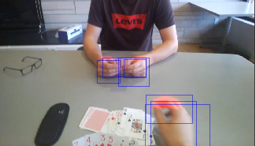

# Mask-RCNN for Hand Detection
Mask-RCNN is a state of the art image segmentation technique. For a given class it yields both a bounding box and a 
binary mask for each instance [1]. To better understand the practical implementation of Mask-RCNN we provide the results 
obtained on a novel dataset using a pretrained model. The EgoHands dataset [2] from Indiana University is used, it
contains 48 videos of 100 frames each with bounding boxes and binary masks for each hand. The implementation of Mask-RCNN 
is in the pytorch torchvision package and closely follows the following tutorial [3]. 



## Implementation: Mask_RCNN.ipnyb
For training our model we construct a pytorch dataset with getitem method that yields image and features (boxes,masks,labels,area) in a round robin fashion by selecting the first frame from the first video, then the first from the second and so on. Selection of training data in this fashion increases the diversity of the images seen and allows the algorithm to learn from a training set more closely resembling the true distribution of hand images. We used a pre-trained resnet-50 backbone (pre-trained on the COCO dataset [4]) with 256 hidden layers. The optimizer used was SGD with a learning rate of 0.005, a momentum of 0.9 and a weight decay of 0.0005. The learning rate scheduling was not used due to performance issues. All training and evaluation was performed on the NYU Prince HPC cluster using 2 gpus, 2 cpus and 24 GB of memory. Final training and testing results were done with a split of using 24 videos (2400 frames) for training and 2 videos (200 frames) for testing. To construct a video out of the evaluated images (all 100 frames from the 25th video) the mask was first turned into RGB with inside values as red, then this was added the original image to create an image with a mask overlay. After this the most significant (highest 50% scoring) boxes were also added as blue rectangles. Due to the lack of model training the images do not perfectly segment the hands and there is an excess of boxes. To create an ideal image segmentation all 4800 frames would need to be trained for over 10 epochs. The algorithm is use to yield masks and bounding boxes for an entire video in the test and training sets, train_video.avi and test_video.avi respectively. 

## Getting Started

Create a python 3.5 virtual environment and install the packages below, additionally download the torchvision repo
for some helper functions

git clone https://github.com/pytorch/vision.git
cd vision
git checkout v0.3.0

cp references/detection/utils.py ../
cp references/detection/transforms.py ../
cp references/detection/coco_eval.py ../
cp references/detection/engine.py ../
cp references/detection/coco_utils.py ../

The following packages were installed into a virtual environment using python 3.5
pandas,pillow,matplotlib, pytorch torchvision cudatoolkit=10.0, cython,opencv,jupyter,pycocotools,keras                                                          
The videos were created using the VirtualDub software [5].

### Installing

A step by step series of examples that tell you how to get a development env running

Say what the step will be

```
Give the example
```

And repeat

```
until finished
```

End with an example of getting some data out of the system or using it for a little demo

## Running the tests

Explain how to run the automated tests for this system

### Break down into end to end tests

Explain what these tests test and why

```
Give an example
```
## References

[1] Kaiming He et al. Mask R-CNN, Facebook AI Research,  January 2018 https://arxiv.org/pdf/1703.06870.pdf 
 
[2] Bambach Sven et al. EgoHands: A Dataset for Hands in Complex Egocentric Interactions, December 2015 http://vision.soic.indiana.edu/projects/egohands/ 
 
[3] Finetuning Instance Segmentation.  https://colab.research.google.com/github/pytorch/vision/blob/temp-tutorial/tutorials/torchvision_ finetuning_instance_segmentation.ipynb 
 
[4] Coco Dataset http://cocodataset.org/#download 
 
[5] http://www.virtualdub.org/ 

## Acknowledgments

* Hat tip to anyone whose code was used
* Inspiration
* etc
